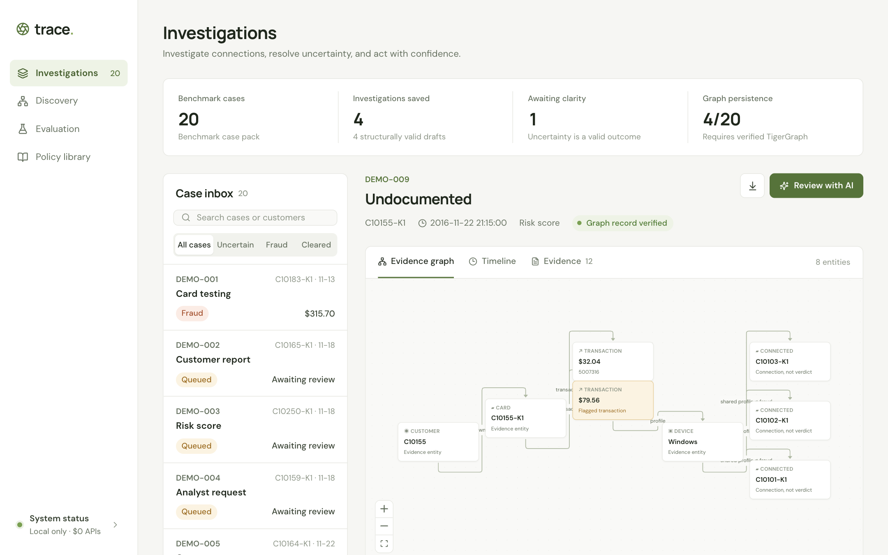
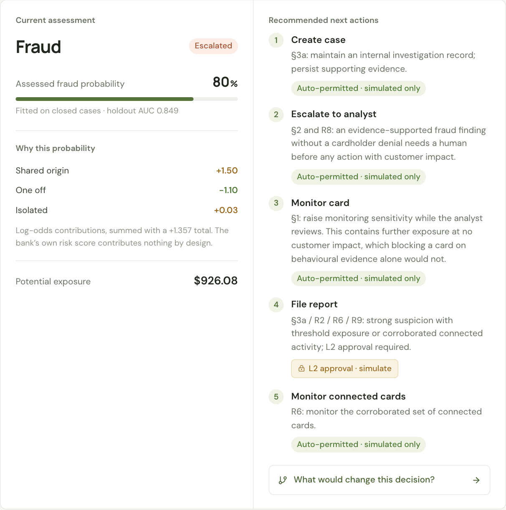
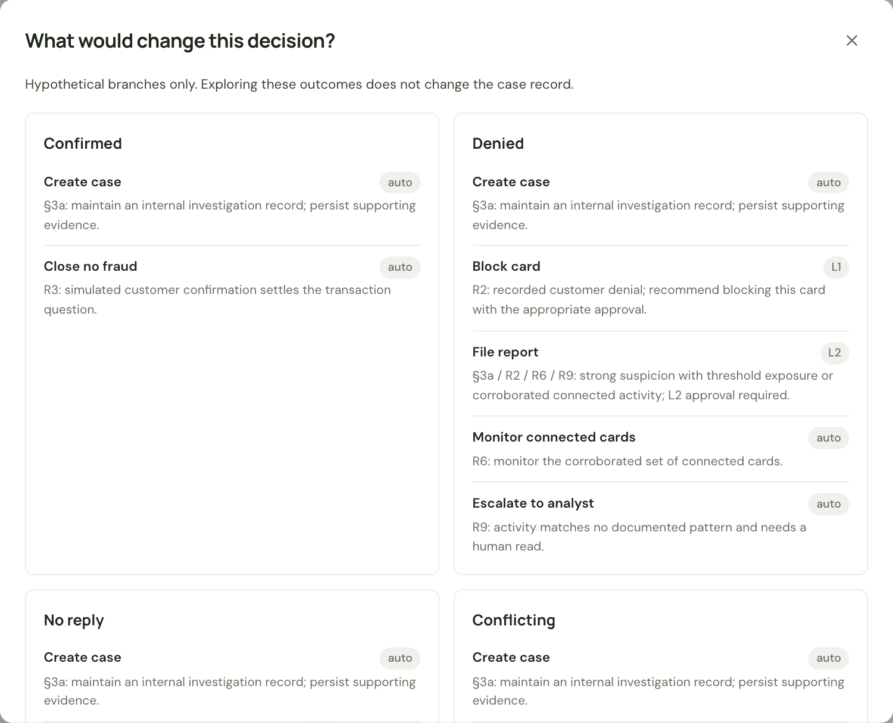
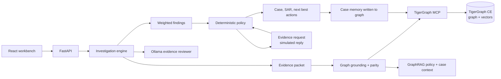

# Trace

**Evidence before action.** An agentic fraud-investigation workbench on a
TigerGraph knowledge graph, running entirely on your own machine.

[](https://github.com/darain24/hhgoa_task4/actions/workflows/ci.yml)




A fraud alert is not a verdict. Trace takes an alert, gathers evidence from the
graph, checks it against what the bank's own closed cases actually looked like,
asks for more evidence when it can't decide, recommends actions under the bank's
policy with their approval routes, and writes the case back into the graph so the
next investigation can find it.

- **Graph-grounded.** Every finding is re-derived in TigerGraph through GSQL over the
  official MCP server. If the graph disagrees, the agent stops.
- **Explainable.** The probability is a sum of named, fitted log-odds weights, and
  the workbench shows the arithmetic.
- **Safe by construction.** A deterministic policy engine chooses every action. The
  language model never does, and nothing touches a real customer or bank.
- **Local and free.** TigerGraph Community Edition in Docker, Ollama for reasoning
  and embeddings. No cloud account, no API key, no billing.

<table>
  <tr>
    <td width="50%"></td>
    <td width="50%"></td>
  </tr>
  <tr>
    <td>The probability as a sum of named log-odds weights, and each recommended action with its approval route.</td>
    <td>What would change the decision: the policy's answer to each possible cardholder reply, without touching the case.</td>
  </tr>
</table>

## The finding that shaped it

Inside the bank's 5,565 closed investigations, its own risk score is
**anti-correlated with confirmed fraud: ROC-AUC 0.053.** Every cleared case scored
0.82 or higher. The score decides which alerts get opened. The loudest ones turn out
to be cardholders with a new phone, a trip, or one big purchase.

Inverting it would score 93% on a balanced holdout. **Trace gives it zero weight**,
and a test pins that down: two cases that differ only in a 0.02 vs 0.99 score
assess identically. What's left is behaviour, and it breaks the obvious intuitions:

| Signal                                        | Naive reading | What the closed cases show                                           |
| --------------------------------------------- | ------------- | -------------------------------------------------------------------- |
| Device marked `New` for the account           | suspicious    | **strongest counter-indicator**: 12.3% fraud among high-score alerts |
| Device already known (`Found`)                | reassuring    | **93.4% fraud**                                                      |
| Billing region never seen before              | suspicious    | more common in _cleared_ cases                                       |
| Amount far above the customer's median        | suspicious    | 23.0% fraud when nothing else changed                                |
| Velocity against the card's own 30-day rhythm | —             | the real signal                                                      |
| Concurrent activity in the home region        | —             | the card was cloned, not carried                                     |

## Results

On the benchmark (IEEE-CIS-derived, 590,742 transactions), fitted on the closed
investigations opened before October 2016 and held out on October's:

| Measure                                  | Result      |
| ---------------------------------------- | ----------- |
| Assessment ROC-AUC (holdout, 278 alerts) | **0.849**   |
| Assessment Brier score                   | **0.157**   |
| Assessment accuracy                      | 0.791       |
| Episode scope Jaccard (250 episodes)     | **0.595**   |
| Episode precision / recall               | 0.78 / 0.72 |
| Bank's own risk score, ROC-AUC           | 0.053       |

The twenty reference answers are in
[`examples/benchmark-results/`](examples/benchmark-results/), promoted only by an
exporter that refuses anything not grounded in the graph, written back and read
back.

## Architecture



More in [docs/ARCHITECTURE.md](docs/ARCHITECTURE.md) and
[docs/ENGINEERING_NOTES.md](docs/ENGINEERING_NOTES.md).

## Quickstart

You need Docker, Python 3.11+, Node 22+, [uv](https://docs.astral.sh/uv/) and
[Ollama](https://ollama.com). It runs on a synthetic demo dataset, so there's
nothing to download first.

```bash
ollama pull qwen3:4b && ollama pull all-minilm
make setup        # Python and Node deps, .env from .env.example
make demo-data    # seeded synthetic dataset in data/raw/
make ingest       # local SQLite projection
make graph        # TigerGraph + MCP via docker compose; schema, data, vectors, verify
make fit          # refit the evidence weights on the closed cases
make up           # API on :8000, workbench on http://127.0.0.1:5173
```

`make graph` also right-sizes TigerGraph for a laptop. Its image is amd64, so on
Apple Silicon it runs emulated: the first `make graph` takes a while and works the
machine hard. `make test` and `make lint` run every check CI does.

The demo dataset is synthetic. It plants card testing, takeovers, new-region runs, a
device ring and the cleared look-alikes, but numbers fitted on it describe the
synthetic data, not the results above. For the full benchmark, set
`TRACE_DATASET=full` in `.env` and use `make full-data` instead of
`make demo-data` (details in the
[engineering notes](docs/ENGINEERING_NOTES.md#full-benchmark-step-by-step)).

## Limitations

- The assessment is fitted on investigated alerts, not the general transaction
  population, and its probabilities are calibrated for that frame.
- Holdout accuracy on October alerts is not benchmark accuracy; the benchmark's
  answer key is hidden.
- Community Edition emulated on a laptop drops services under load. A case whose
  write-back fails stays unverified rather than claiming it, and
  `run_benchmark.py --require-graph` re-runs it.
- Approvals in the UI are demo controls, not role-based authentication. Customer
  replies are simulated and labelled as such. No banking or regulatory action is
  ever taken.

## Repository map

- `backend/tracework/`: evidence and weighted findings (`analysis`), GraphRAG and
  parity (`retrieval`), the MCP adapter and case persistence (`tigergraph`), the
  bank's rules (`policy`), orchestration (`engine`) and the API.
- `frontend/`: React workbench with the evidence graph, timeline, findings
  breakdown, scenario explorer and approvals.
- `tigergraph/`: schema and GSQL queries.
- `scripts/`: demo-data generation, download, ingest, provisioning, verification,
  fitting, benchmark runs and export.
- `docs/`: architecture, engineering notes, verification report, walkthrough.

## Origin

Trace started as my solo entry for TigerGraph's Hacker House Goa 2026 (Task 4),
and has since been extended into a standalone project.

## License and data

Code is MIT-licensed (see [LICENSE](LICENSE)). The benchmark data is an adaptation
of the IEEE-CIS Fraud Detection dataset (Vesta Corporation, via the IEEE
Computational Intelligence Society), prepared by TigerGraph. None of it is
redistributed here; the demo dataset is generated from scratch. See
[DATA.md](DATA.md).
